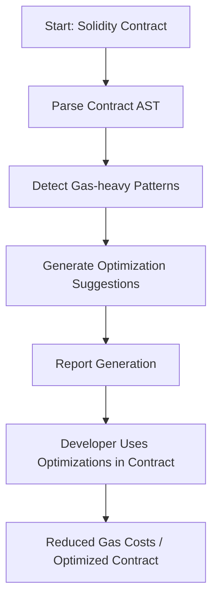

# GasOptimizer

**Smart Gas Optimizer: An Analyzer for Solidity Contracts**

---

## 🔹 Overview

GasOptimizer is an open-source tool for Ethereum developers designed to **analyze, detect, and optimize gas consumption** in Solidity smart contracts. High gas costs are a major pain point for dApp developers, and existing tools often provide metrics without actionable suggestions. GasOptimizer fills this gap by giving **developers practical recommendations** to reduce transaction costs and improve contract efficiency.

---

## 🔹 Problem Statement

- Ethereum smart contracts often incur **high gas fees** due to inefficient patterns.
- Existing tools report gas usage but **do not guide developers on how to optimize**.
- Developers waste time testing and manually optimizing contracts.

---

## 🔹 Proposed Solution

GasOptimizer provides:

1. **Static Analysis** – Parse Solidity contracts and detect gas-heavy patterns.
2. **Actionable Recommendations** – Suggest optimizations for loops, storage, calldata, and more.
3. **Integration with Developer Tools** – Compatible with **Foundry** and **Hardhat** workflows.
4. **Report Generation** – Generate detailed, human-readable reports showing gas consumption and savings.

**Technical Flowchart:**



---

## 🔹 Project Structure

```
GasOptimizer/
│
├── contracts/          # Solidity contracts for analysis
│   └── Example.sol
├── scripts/            # PoC analysis scripts
│   └── analyze.js
├── reports/            # Generated gas reports
├── package.json        # Node.js dependencies and scripts
├── foundry.toml        # Foundry configuration
├── README.md           # This README
└── .gitignore          # Ignored files and folders
```

---

## 🔹 Features

- Parse Solidity contracts and detect functions with high gas usage
- Provide actionable optimization suggestions
- Generate comprehensive reports for developers
- Integrate seamlessly with Foundry and Hardhat
- Open-source and extendable for future improvements

---

## 🔹 Installation (Mac + Node 18+ + Foundry)

```bash
# Clone the repository
git clone https://github.com/<your-username>/GasOptimizer.git
cd GasOptimizer

# Install Node dependencies
npm install

# Install Foundry dependencies
forge install
```

---

## 🔹 Usage

1. Add Solidity contracts to `/contracts`
2. Run the analyzer:

```bash
npm run analyze
```

3. Check generated reports in `/reports`

To build/test contracts using Foundry:

```bash
forge build
forge test
```

---

## 🔹 Contributing

We welcome contributions from developers of all levels:

- Fork the repository
- Create a feature branch
- Submit a pull request

---

## 🔹 License

MIT License
